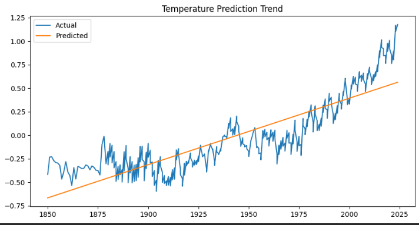
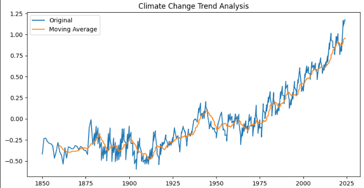
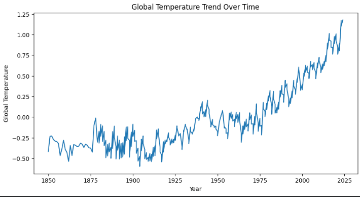

# Climate Change Trend Analysis using Data Science

## Overview
Climate change is one of the most significant environmental challenges worldwide. 
This project analyzes global temperature trends using data science and machine learning 
techniques. Historical temperature data is used to visualize trends, analyze patterns, 
and predict future temperature changes.

## Project Summary
This project analyzes global temperature trends from 1850 to present. The dataset is 
used to visualize long-term climate change patterns, apply moving average smoothing, 
and build a Linear Regression model to predict future temperature trends.

## Dataset
Global Temperature Dataset (annual.csv)

The dataset contains:
- Source: Dataset source name
- Year: Year of observation
- Mean: Global temperature anomaly

## Technologies Used
- Python
- Pandas
- NumPy
- Matplotlib
- Scikit-learn

## Methodology
1. Data Loading
2. Data Exploration
3. Temperature Trend Visualization
4. Moving Average Analysis
5. Prediction using Linear Regression
6. Result Visualization

## Results

### Global Temperature Trend

### Climate Change Moving Average

### Temperature Prediction Trend

## Key Insights
- Global temperature shows increasing trend
- Climate change pattern observed over time
- Moving average shows long-term warming trend
- Linear Regression predicts future temperature rise

## Future Scope
- Use advanced machine learning models
- Predict future climate conditions
- Use multiple climate datasets
- Build interactive dashboard

## Author
**Siddhi Malode**
